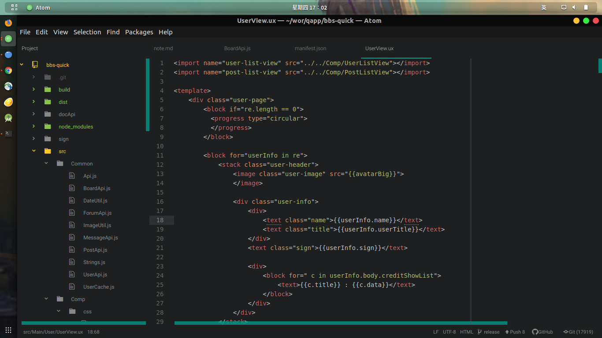
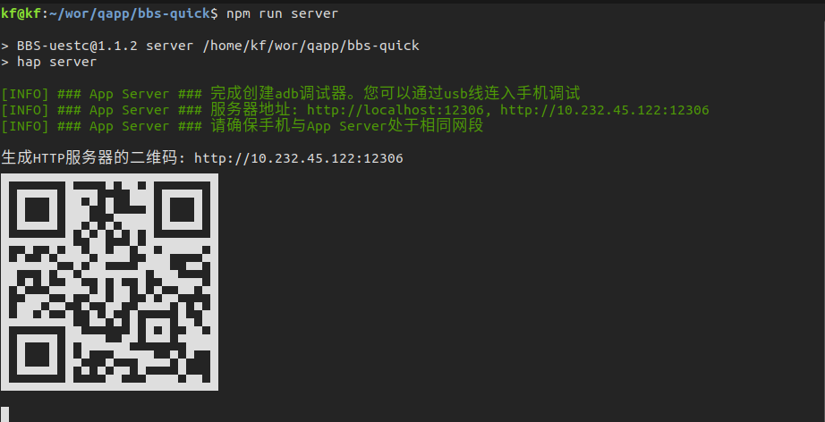
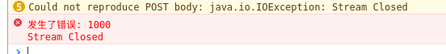

# quickapp 踩坑记 (一) 入门坑与为什么踩这个坑

## 简介

主要讲了
- ubuntu + atom + 等等等等搭建快应用开发环境
- 调试相关
  - 无法通过wifi调试以及可能原因
  - 由于调试导致的上传失败
- 通过 adb 调试快应用
- 闲话：为何如坑

## 正文

### 基本配置
在 ubuntu  下开发的沙沙沙

我的ubuntu是 18.04

install node

install atom

atom
--> Edit
--> Preferences
--> open config folder
--> config.cson

配置对ux文件的语法高亮
``` Json
"*":
  core:
    customFileTypes:
      "text.html.basic": [
        "ux"
      ]
```
然后随意弄一下语法高亮
配置完之后是这样子的



然后就算很正常的npm install -g hap-toolkit

> 可以选择装一个emmet插件辅助自动补全

走起～
## 关于调试

### 无法在线更新
一开始的时候遇到过无法在线安装的问题，后来发现不止是快应用，其他用wifi调试的类似开发方式有时也会遇到。这里的其他开发方式指的是 Ionic 的 Ionic DevApp和React Native的Expo。这两者也是在手机上运行了一个'容器'，方便实现热加载，利用chrome dev tool进行调试等。

言归正传，快应用调试的时候运行
``` sh
npm run server
```
会生成一堆东西:



这里生成ip地址不一定是对应的本机的地址(当然我图中的是正确的)。如果电脑上装了虚拟机/docker/其他容器，这里的服务器地址**有可能**会是虚拟机的网卡的ip,同时二维码对应的也是虚拟机的ip，这样扫码是**不能在线更新**的（因为连不上)

如果扫玛一直扫不出来的话，可以考虑换一个命令行终端。比如我之前用Win10的cmd.exe的时候就不像一个二维码(顺手安利一波*cmder*)。

当然直接手动输入地址也是ok的。

>在这里顺带感谢一下在我遇到这个问题时群里通过ip地址看出是虚拟机ip的那个大哥

 ps:这个问题在官方支持usb调试之后就与我绝缘了。
### 无法上传

在调用快应用的系统能力之网络之上传时，有可能会发生这样的错误



然后代码是这样子的：

``` js
import request from '@system.request' //正常的导入

/**
 * 正常的使用
 */
request.upload({
  url : "http://",
  files : o.files,
  data : o.data,
  method:"POST",
  success : onSuccess,
  fail: onFetchFail
})
```

这通常是发生在开了调试工具的时候，一边进行调试一边上传就是报错
``` log
发生了错误: 1000
Stream Closed
```
这时候只需要拔掉你的usb线,再次上传，一切ok。

如果想要查看上传过程中的log的话可以使用adb。

### adb 调试快应用
鉴于快应用开发的应该是前端的同学，可能不太了解adb是什么
adb = Android Debug Bridge ,android开发可能会用得比较多一点。

一般想要配置adb的话，下载一个android sdk tool就好了(把整个androidt stuido下载下来也是可以的)，然后配置环境变量,
一般adb是在
``` path
$ANDROID_SDK_HOME/platform-tools/
```
这个目录下。

有时候不想打开chrome-dev-tool，只想在命令行查看log,就可以使用

``` js
console.info('你的log')
// 好像需要console.info()才可以
// console.log()的日志不能被下面的命令抓取
//（记得不清+不想做实验了)
```
+
``` shell
adb logcat | grep JsConsole
```

adb logcat 是读取手机运行的日志，快应用运行的日志自然也包含在里面。

然后使用 grep JsConsole 进行筛选。之所以用*JsConsole*，是因为我目测得出快应用引擎(无论是官方的快应用预览器还是厂商自己的快应用引擎) 都是这个tag。

windows同学没有grep命令的话......可以使用windows上支持bash的终端工具。

### 一些闲话
比起前端开发，我更加熟悉的可能是android端的开发。虽然也大概清楚前端开发是怎么一回事，但是完完整整地用标记语言+js+css开发一个东西的经验并不是很多。所以如有错漏的，不专业的地方(后续会很多)请轻喷。写这篇东西一是为了征文大赛，二是为了顺带梳理一番开发过程中遇到的问题。

同时最近忙成狗的我也没时间看别人的征文，如果有些内容已经有人指出了，如有巧合纯属雷同，啦啦啦啦啦啦。

在年初的时候学长让了解一下快应用和flutter，然后被flutter的语法劝退之后尝试写起了快应用。想着当时微信小程序封测的时候也对小程序浅尝辄止了一番（学校的小团体搞了比赛，赚了个androd高级进阶和鼠标让我甚是高兴，难以忘怀，特此讨打），但是那时候由于种种原因一直在AIDE上写app，也就没机会没能力继续接触。

而去年学校微信小程序比赛搞起来，发现小程序的IDE和开发流程都变了很多。（2333，无意义感慨）

刚好快应用出来，想着有机会从初期接触一个框架，然后了解这个东西是怎么一步步完善起来的，于是决定踩坑。
